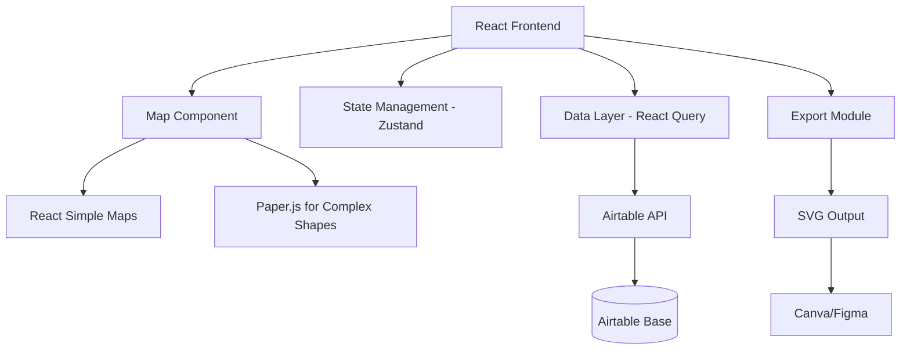

# Interactive Burning Man Map MVP Development Plan

## Project Overview
An interactive map system for tracking BED (Bureau of Erotic Discourse) program progress across theme camps in Black Rock City. This MVP will serve as the foundation for a generalizable framework supporting multiple map overlays.

## Architecture Overview



## Airtable Schema Design

```javascript
const airtableSchema = {
  tableName: "BED_Camp_Progress",
  fields: {
    camp_name: "Single line text",
    user_name: "Single line text", 
    email: "Email",
    placement_address: "Single line text", // "C & 3:45" format
    bed_status: "Single select", // Options: none, video_complete, buddy_assigned, fully_implemented
    buddy_name: "Single line text",
    last_updated: "Last modified time",
    notes: "Long text",
    // Computed fields for map rendering
    block_id: "Formula", // CONCATENATE(LEFT(placement_address, 1), "_", MID(placement_address, 5, 4))
    color_hex: "Formula" // Based on bed_status
  }
};
```

## Technology Stack
- **Frontend**: React with Vite
- **Map Rendering**: React Simple Maps + Paper.js
- **State Management**: Zustand
- **Data Fetching**: React Query
- **Backend**: Airtable API
- **Hosting**: Render
- **SVG Processing**: Paper.js, SVGO

## Color Coding System
- **Gray (#9CA3AF)**: No engagement
- **Yellow (#FDE047)**: Video training completed
- **Orange (#FB923C)**: BED Buddy assigned
- **Green (#4ADE80)**: Full implementation with policy

---

## Development Roadmap

### Week 1: Foundation with Real Geometry
1. Set up React app with Paper.js integration
2. Import and parse the BRC SVG
3. Implement block generation from SVG paths
4. Create basic click detection on generated blocks

### Week 2: Data Integration
1. Set up Airtable with camp data
2. Implement address parsing for all BRC formats
3. Map camps to geometric blocks
4. Add color coding based on BED status

### Week 3: Interactivity & Polish
1. Add hover tooltips with camp details
2. Implement click-to-update functionality
3. Handle multi-camp blocks with selection modal
4. Add smooth color transitions

### Week 4: Export & Enhancement
1. Implement SVG export with overlay preservation
2. Add legend and metadata to exports
3. Test Canva/Figma compatibility
4. Add bulk update interface

---

## Week 1: Detailed Implementation Tasks

### Day 1: Project Setup & Environment Configuration

#### 1.1 Initialize React Project with Vite
```bash
# Create new Vite project with React template
npm create vite@latest brc-bed-map -- --template react
cd brc-bed-map

# Install core dependencies
npm install react-simple-maps paper zustand @tanstack/react-query
npm install -D tailwindcss postcss autoprefixer @types/paper
npx tailwindcss init -p

# Install additional utilities
npm install axios classnames react-tooltip
```

#### 1.2 Project Structure Setup
```
brc-bed-map/
├── public/
│   └── assets/
│       └── brc-2025-base.svg
├── src/
│   ├── components/
│   │   ├── BurningManMap/
│   │   │   ├── index.jsx
│   │   │   ├── MapLoader.jsx
│   │   │   └── InteractiveMapLayer.jsx
│   ├── services/
│   │   └── airtable.js
│   ├── utils/
│   │   ├── svgParser.js
│   │   ├── addressParser.js
│   │   ├── bedProgress.js
│   │   └── mapGeometry.js
│   ├── hooks/
│   │   └── useMapData.js
│   ├── store/
│   │   └── mapStore.js
│   ├── App.jsx
│   ├── App.css
│   └── main.jsx
├── .env.local
├── package.json
└── vite.config.js
```

#### 1.3 Configure Vite for SVG and Paper.js
```javascript
// vite.config.js
import { defineConfig } from 'vite'
import react from '@vitejs/plugin-react'

export default defineConfig({
  plugins: [react()],
  assetsInclude: ['**/*.svg'],
  optimizeDeps: {
    include: ['paper']
  }
})
```

### Day 2: SVG Import and Basic Parsing

#### 2.1 Create SVG Parser Utility
```javascript
// src/utils/svgParser.js
import paper from 'paper';

export class SVGParser {
  constructor() {
    // Initialize Paper.js
    if (typeof window !== 'undefined') {
      this.canvas = document.createElement('canvas');
      paper.setup(this.canvas);
    }
  }

  async loadAndParseSVG(svgPath) {
    try {
      const response = await fetch(svgPath);
      const svgText = await response.text();
      
      // Parse SVG structure
      const parser = new DOMParser();
      const doc = parser.parseFromString(svgText, 'image/svg+xml');
      
      // Extract key elements
      const elements = {
        rings: this.extractRingRoads(doc),
        radials: this.extractRadialRoads(doc),
        plazas: this.extractPlazas(doc),
        landmarks: this.extractLandmarks(doc),
        viewBox: doc.documentElement.getAttribute('viewBox')
      };
      
      return {
        original: svgText,
        parsed: elements,
        document: doc
      };
    } catch (error) {
      console.error('Error parsing SVG:', error);
      throw error;
    }
  }

  extractRingRoads(doc) {
    const rings = {};
    const ringGroup = doc.getElementById('Ring_Roads');
    
    if (ringGroup) {
      const ringNames = ['A', 'B', 'C', 'D', 'E', 'F', 'G', 'H', 'I', 'J'];
      
      ringNames.forEach(name => {
        const ringElement = ringGroup.querySelector(`#${name}`);
        if (ringElement) {
          const paths = ringElement.querySelectorAll('path');
          rings[name] = Array.from(paths).map(path => ({
            d: path.getAttribute('d'),
            id: path.id || name
          }));
        }
      });
    }
    
    return rings;
  }

  extractRadialRoads(doc) {
    const radials = {};
    
    // Main radial roads
    const mainRadials = doc.getElementById('Main_Radial_Roads');
    if (mainRadials) {
      const groups = mainRadials.querySelectorAll('g');
      groups.forEach(group => {
        const id = group.id;
        const lines = group.querySelectorAll('line, polyline');
        radials[id] = Array.from(lines).map(line => ({
          x1: line.getAttribute('x1'),
          y1: line.getAttribute('y1'),
          x2: line.getAttribute('x2'),
          y2: line.getAttribute('y2'),
          points: line.getAttribute('points')
        }));
      });
    }
    
    return radials;
  }

  extractPlazas(doc) {
    const plazas = [];
    const plazaGroup = doc.getElementById('Plazas');
    
    if (plazaGroup) {
      const circles = plazaGroup.querySelectorAll('circle');
      circles.forEach(circle => {
        plazas.push({
          cx: parseFloat(circle.getAttribute('cx')),
          cy: parseFloat(circle.getAttribute('cy')),
          r: parseFloat(circle.getAttribute('r')),
          id: circle.parentElement.id
        });
      });
    }
    
    return plazas;
  }

  extractLandmarks(doc) {
    const landmarks = {};
    
    // The Man
    const theMan = doc.getElementById('The_Man');
    if (theMan) {
      const circle = theMan.querySelector('circle');
      landmarks.man = {
        cx: parseFloat(circle.getAttribute('cx')),
        cy: parseFloat(circle.getAttribute('cy')),
        r: parseFloat(circle.getAttribute('r'))
      };
    }
    
    // Center Camp
    const centerCamp = doc.getElementById('_2024_Center_Camp');
    if (centerCamp) {
      landmarks.centerCamp = {
        paths: Array.from(centerCamp.querySelectorAll('path')).map(p => p.getAttribute('d'))
      };
    }
    
    return landmarks;
  }
}

export const svgParser = new SVGParser();
```

#### 2.2 Create Map Loader Component
```javascript
// src/components/BurningManMap/MapLoader.jsx
import React, { useEffect, useState } from 'react';
import { svgParser } from '../../utils/svgParser';

export const MapLoader = ({ onLoad }) => {
  const [loading, setLoading] = useState(true);
  const [error, setError] = useState(null);

  useEffect(() => {
    const loadMap = async () => {
      try {
        setLoading(true);
        const mapData = await svgParser.loadAndParseSVG('/assets/brc-2025-base.svg');
        onLoad(mapData);
      } catch (err) {
        setError(err.message);
      } finally {
        setLoading(false);
      }
    };

    loadMap();
  }, [onLoad]);

  if (loading) {
    return (
      <div className="flex items-center justify-center h-screen">
        <div className="text-lg">Loading Black Rock City map...</div>
      </div>
    );
  }

  if (error) {
    return (
      <div className="flex items-center justify-center h-screen text-red-500">
        Error loading map: {error}
      </div>
    );
  }

  return null;
};
```

### Day 3: Block Generation from SVG Paths

#### 3.1 Implement Block Generation Algorithm
```javascript
// src/utils/mapGeometry.js
import paper from 'paper';

export class BlockGenerator {
  constructor(svgData) {
    this.svgData = svgData;
    this.blocks = [];
    
    // Initialize Paper.js project
    if (!paper.project) {
      paper.setup(document.createElement('canvas'));
    }
  }

  generateAllBlocks() {
    const { rings, radials } = this.svgData.parsed;
    
    // Define time slots based on radial roads
    const timeSlots = this.extractTimeSlots(radials);
    const ringNames = Object.keys(rings).sort();
    
    // Generate blocks for each ring/time combination
    ringNames.forEach((ringName, ringIndex) => {
      const innerRing = rings[ringName];
      const outerRing = ringIndex < ringNames.length - 1 ? 
        rings[ringNames[ringIndex + 1]] : null;
      
      timeSlots.forEach((slot, slotIndex) => {
        if (slotIndex < timeSlots.length - 1) {
          const block = this.generateBlock(
            ringName,
            innerRing,
            outerRing,
            timeSlots[slotIndex],
            timeSlots[slotIndex + 1]
          );
          
          if (block) {
            this.blocks.push(block);
          }
        }
      });
    });
    
    return this.blocks;
  }

  generateBlock(ringName, innerRing, outerRing, startTime, endTime) {
    try {
      // Create Paper.js paths from SVG path data
      const innerPath = this.createCompoundPath(innerRing);
      const outerPath = outerRing ? this.createCompoundPath(outerRing) : null;
      
      // Create radial lines for time boundaries
      const startRadial = this.createRadialLine(startTime);
      const endRadial = this.createRadialLine(endTime);
      
      // Find intersection points
      const intersections = this.findIntersections(
        innerPath, outerPath, startRadial, endRadial
      );
      
      if (!intersections.valid) {
        return null;
      }
      
      // Create block path
      const blockPath = this.createBlockPath(intersections);
      
      return {
        id: `${ringName}_${startTime}-${endTime}`,
        street: ringName,
        startTime,
        endTime,
        path: blockPath,
        svgPath: blockPath.exportSVG({ asString: true }),
        bounds: blockPath.bounds,
        center: blockPath.bounds.center
      };
    } catch (error) {
      console.error(`Error generating block ${ringName} ${startTime}-${endTime}:`, error);
      return null;
    }
  }

  createCompoundPath(ringData) {
    const compoundPath = new paper.CompoundPath();
    
    ringData.forEach(segment => {
      if (segment.d) {
        const path = new paper.Path(segment.d);
        compoundPath.addChild(path);
      }
    });
    
    return compoundPath;
  }

  createRadialLine(timeString) {
    // Convert time to angle (6:00 is 0 degrees, clockwise)
    const angle = this.timeToAngle(timeString);
    const radians = (angle - 90) * Math.PI / 180;
    
    // Create line from center outward
    const center = new paper.Point(622.5, 272.04); // The Man's position
    const endpoint = center.add(new paper.Point(1000, 0).rotate(angle));
    
    return new paper.Path.Line(center, endpoint);
  }

  timeToAngle(timeString) {
    const [hours, minutes = 0] = timeString.split(':').map(Number);
    // Convert to degrees (12:00 = 0°, 3:00 = 90°, 6:00 = 180°, etc.)
    return (hours % 12) * 30 + (minutes / 60) * 30;
  }

  findIntersections(innerPath, outerPath, startRadial, endRadial) {
    const intersections = {
      innerStart: null,
      innerEnd: null,
      outerStart: null,
      outerEnd: null,
      valid: false
    };
    
    // Find intersections with inner ring
    const innerStartIntersections = innerPath.getIntersections(startRadial);
    const innerEndIntersections = innerPath.getIntersections(endRadial);
    
    if (innerStartIntersections.length > 0 && innerEndIntersections.length > 0) {
      intersections.innerStart = innerStartIntersections[0].point;
      intersections.innerEnd = innerEndIntersections[0].point;
      
      // Find intersections with outer ring if it exists
      if (outerPath) {
        const outerStartIntersections = outerPath.getIntersections(startRadial);
        const outerEndIntersections = outerPath.getIntersections(endRadial);
        
        if (outerStartIntersections.length > 0 && outerEndIntersections.length > 0) {
          intersections.outerStart = outerStartIntersections[0].point;
          intersections.outerEnd = outerEndIntersections[0].point;
          intersections.valid = true;
        }
      } else {
        // For outermost ring, use extended radial endpoints
        intersections.outerStart = startRadial.lastSegment.point;
        intersections.outerEnd = endRadial.lastSegment.point;
        intersections.valid = true;
      }
    }
    
    return intersections;
  }

  createBlockPath(intersections) {
    const path = new paper.Path();
    path.closed = true;
    
    // Start at inner ring start point
    path.moveTo(intersections.innerStart);
    
    // TODO: Add arc along inner ring (this is complex and needs the curve segments)
    // For now, using straight lines as placeholder
    path.lineTo(intersections.innerEnd);
    path.lineTo(intersections.outerEnd);
    path.lineTo(intersections.outerStart);
    path.closePath();
    
    return path;
  }

  extractTimeSlots(radials) {
    // Extract time slots from radial road IDs
    const slots = Object.keys(radials)
      .map(id => {
        // Extract time from IDs like "_3:00-9:00", "_3:30-9:30", etc.
        const match = id.match(/(\d{1,2}:\d{2})/);
        return match ? match[1] : null;
      })
      .filter(Boolean)
      .sort((a, b) => {
        const [aHour, aMin] = a.split(':').map(Number);
        const [bHour, bMin] = b.split(':').map(Number);
        return (aHour * 60 + aMin) - (bHour * 60 + bMin);
      });
    
    // Remove duplicates
    return [...new Set(slots)];
  }
}
```

### Day 4: Basic Click Detection and Visual Feedback

#### 4.1 Create Interactive Map Component
```javascript
// src/components/BurningManMap/index.jsx
import React, { useState, useCallback, useEffect } from 'react';
import { MapLoader } from './MapLoader';
import { BlockGenerator } from '../../utils/mapGeometry';
import { useMapStore } from '../../store/mapStore';

export const BurningManMap = () => {
  const [mapData, setMapData] = useState(null);
  const [blocks, setBlocks] = useState([]);
  const { selectedBlock, hoveredBlock, setSelectedBlock, setHoveredBlock } = useMapStore();

  const handleMapLoad = useCallback((data) => {
    setMapData(data);
    
    // Generate clickable blocks
    const generator = new BlockGenerator(data);
    const generatedBlocks = generator.generateAllBlocks();
    setBlocks(generatedBlocks);
  }, []);

  const handleBlockClick = useCallback((block) => {
    console.log('Block clicked:', block.id);
    setSelectedBlock(block);
  }, [setSelectedBlock]);

  const handleBlockHover = useCallback((block) => {
    setHoveredBlock(block);
  }, [setHoveredBlock]);

  if (!mapData) {
    return <MapLoader onLoad={handleMapLoad} />;
  }

  return (
    <div className="relative w-full h-screen bg-gray-100">
      {/* Base SVG Layer */}
      <div 
        className="absolute inset-0 opacity-30"
        dangerouslySetInnerHTML={{ __html: mapData.original }}
      />
      
      {/* Interactive Overlay */}
      <svg 
        viewBox={mapData.parsed.viewBox}
        className="absolute inset-0 w-full h-full"
      >
        {blocks.map(block => (
          <path
            key={block.id}
            d={block.svgPath}
            fill="transparent"
            stroke="#333"
            strokeWidth="1"
            className="cursor-pointer hover:fill-blue-200 hover:fill-opacity-50 transition-all"
            onClick={() => handleBlockClick(block)}
            onMouseEnter={() => handleBlockHover(block)}
            onMouseLeave={() => handleBlockHover(null)}
          />
        ))}
        
        {/* Highlight selected block */}
        {selectedBlock && (
          <path
            d={selectedBlock.svgPath}
            fill="#3B82F6"
            fillOpacity="0.5"
            stroke="#1E40AF"
            strokeWidth="2"
          />
        )}
      </svg>
      
      {/* Info Panel */}
      {selectedBlock && (
        <div className="absolute top-4 right-4 bg-white p-4 rounded shadow-lg">
          <h3 className="font-bold text-lg">Selected Block</h3>
          <p>Street: {selectedBlock.street}</p>
          <p>Time: {selectedBlock.startTime} - {selectedBlock.endTime}</p>
          <p className="text-sm text-gray-600 mt-2">
            Click integration with Airtable coming in Week 2!
          </p>
        </div>
      )}
    </div>
  );
};
```

#### 4.2 Create Zustand Store
```javascript
// src/store/mapStore.js
import { create } from 'zustand';

export const useMapStore = create((set) => ({
  selectedBlock: null,
  hoveredBlock: null,
  viewMode: 'bed_progress',
  
  setSelectedBlock: (block) => set({ selectedBlock: block }),
  setHoveredBlock: (block) => set({ hoveredBlock: block }),
  setViewMode: (mode) => set({ viewMode: mode }),
  
  // Reset state
  reset: () => set({
    selectedBlock: null,
    hoveredBlock: null,
    viewMode: 'bed_progress'
  })
}));
```

#### 4.3 Update Main App Component
```javascript
// src/App.jsx
import React from 'react';
import { QueryClient, QueryClientProvider } from '@tanstack/react-query';
import { BurningManMap } from './components/BurningManMap';
import './App.css';

const queryClient = new QueryClient({
  defaultOptions: {
    queries: {
      refetchOnWindowFocus: false,
      retry: 1,
    },
  },
});

function App() {
  return (
    <QueryClientProvider client={queryClient}>
      <div className="App">
        <BurningManMap />
      </div>
    </QueryClientProvider>
  );
}

export default App;
```

### Day 5: Testing and Refinement

#### 5.1 Add Development Tools
```javascript
// src/components/DevTools.jsx
import React from 'react';
import { useMapStore } from '../store/mapStore';

export const DevTools = ({ blocks }) => {
  const { selectedBlock, viewMode } = useMapStore();
  
  if (process.env.NODE_ENV !== 'development') {
    return null;
  }
  
  return (
    <div className="fixed bottom-4 left-4 bg-black bg-opacity-80 text-white p-4 rounded text-sm max-w-md">
      <h4 className="font-bold mb-2">Dev Tools</h4>
      <div>Total Blocks: {blocks.length}</div>
      <div>View Mode: {viewMode}</div>
      {selectedBlock && (
        <div className="mt-2">
          <div>Selected: {selectedBlock.id}</div>
          <div>Center: ({selectedBlock.center.x.toFixed(1)}, {selectedBlock.center.y.toFixed(1)})</div>
        </div>
      )}
    </div>
  );
};
```

#### 5.2 Performance Optimization
```javascript
// src/utils/mapOptimization.js
export const optimizeBlocks = (blocks) => {
  // Group blocks by street for efficient rendering
  const groupedBlocks = blocks.reduce((acc, block) => {
    if (!acc[block.street]) {
      acc[block.street] = [];
    }
    acc[block.street].push(block);
    return acc;
  }, {});
  
  // Sort blocks within each street by time
  Object.keys(groupedBlocks).forEach(street => {
    groupedBlocks[street].sort((a, b) => {
      const aTime = parseTimeToMinutes(a.startTime);
      const bTime = parseTimeToMinutes(b.startTime);
      return aTime - bTime;
    });
  });
  
  return groupedBlocks;
};

const parseTimeToMinutes = (timeString) => {
  const [hours, minutes = 0] = timeString.split(':').map(Number);
  return hours * 60 + minutes;
};
```

### Week 1 Deliverables Checklist

- [ ] React app with Vite configured and running
- [ ] SVG parser that extracts rings, radials, and landmarks
- [ ] Block generation creating clickable regions
- [ ] Basic hover and click interactions working
- [ ] Visual feedback for selected blocks
- [ ] Development tools for debugging
- [ ] Clean, modular code structure
- [ ] Basic performance optimizations
- [ ] Documentation for all utilities
- [ ] Git repository with clear commit history

### Testing Instructions

1. **Verify SVG Loading**
   - Check console for parsed SVG data
   - Ensure all ring roads (A-J) are extracted
   - Verify radial roads are identified

2. **Test Block Generation**
   - Count total blocks (should be ~200-300)
   - Verify blocks align with visual grid
   - Check for any missing intersections

3. **Interaction Testing**
   - Click each street to verify selection
   - Test hover states across different areas
   - Verify no dead zones in the map

4. **Performance Check**
   - Monitor frame rate during interactions
   - Check memory usage with dev tools
   - Ensure smooth hover transitions

### Next Steps for Week 2
- Set up Airtable base with schema
- Implement API authentication
- Create address parsing logic
- Build data synchronization layer
- Add camp-to-block mapping